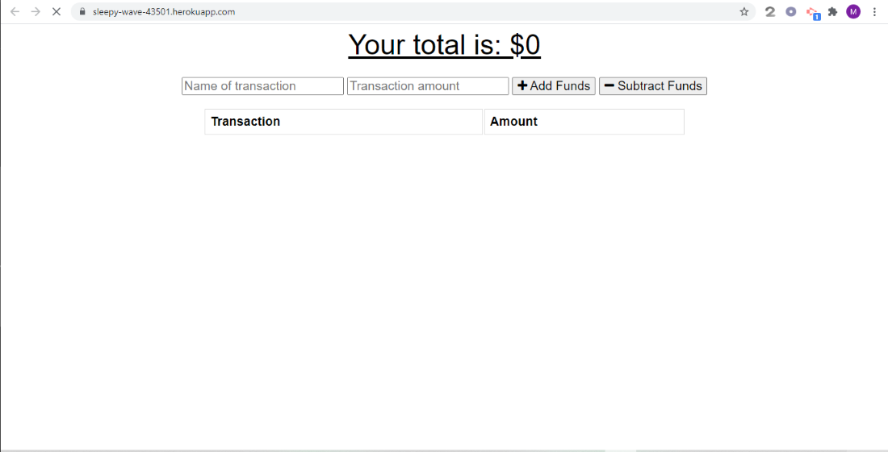

# Budget-Pro
Budget-Pro is a progressive web application or PWA for short.  The user is able to keep track of their budget even if they loose connection and whatever transactions they recordered while offline will be updated once connection is restored. 

## Built WIth: 
* Node.js
* MongodDB
* JavaScript 
* HTML
* CSS
* Heroku
* Mongo Atlas

## Constructing the Manifest:
I created a "mnifest.webmanifest" file to work with the service workers thatr contained keys for background_color and icon images.

## Constructing the Service Workers:
First I created a variable to store the following:
    "/",
    "/index.html",
    "/styles.css",
    "/index.js",
    "/icons/icon-192x192.png",
    "/icons/icon-512x512.png",
    "/manifest.webmanifest",
    
    Then I created "event listners" that triggered network requests so that it would improve user experince and provide offline access to data that was cashed. 

## Constructing the db.js:
In this file I created an "objectStore" which stored transactions the user tracked while the application was offline.  

[Budget-Pro](https://sleepy-wave-43501.herokuapp.com/)

